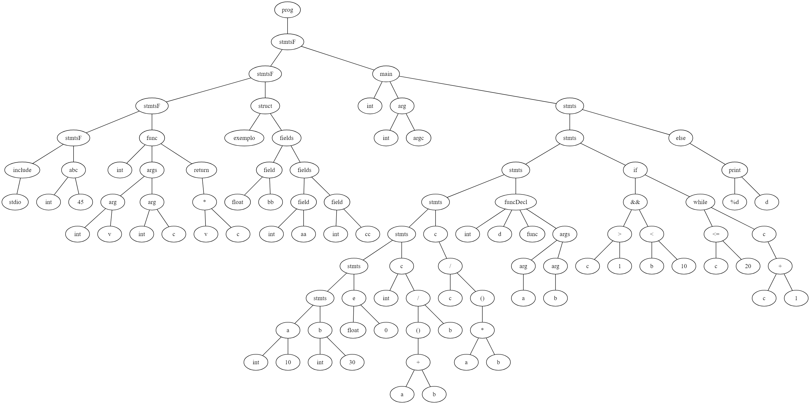

# CtoRust
Compiler to translate C to Rust - Project for Compilers subject

## How to execute it:
* Make sure all packages needed are installed
* Run in terminal:
```
make
./cmp < teste.txt
```
*teste.txt* is a program written in C language.

## Want to see the graph generated?
Copy the code that appears in terminal and looks like this in [Graphviz online](https://dreampuf.github.io/GraphvizOnline/):
```
graph prog {
    ....
    ....
    ....
}
```

The graph from the program will appear.




Right below it a Rust code should appear. You can check how it should like in the Rust *teste* file.

To check if the code works, open [Rust Playground](https://play.rust-lang.org/) and paste the code there. Some warnings should appear, however no errors.

## Functionalities:

* Include (stdio)
* Global variables (static)
* Single line comments
* Simple functions
* Structs
* Main function
* Mutable variables (integer and float)
* Aritimetic precedence (`(a+b)/c` is different than `a+b/c`)
* Logic precedence (`>` has higher precedence than `&&` for example)
* Function calls (`a = function(a)`)
* *If* statement
* *Else* statement
* *While* statement
